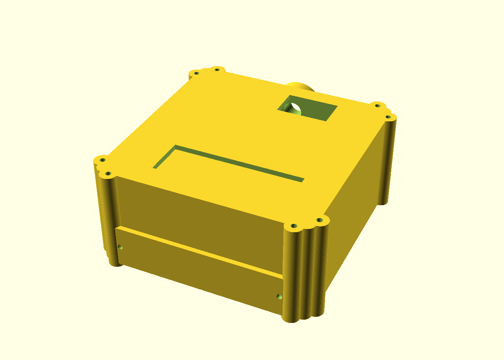
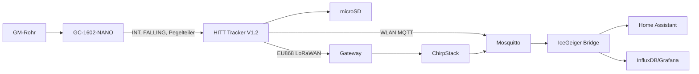

# IceGeigerCounter

Mobiler Geigerzähler/Strahlungslogger mit **Home Assistant, WLAN/MQTT, GNSS, microSD und EU868-LoRaWAN**.

> IceGeiger ist kein geeichtes Dosimeter. CPM/Impulse bleiben der Primärmesswert; µSv/h ist eine röhrenabhängige Ableitung.

## V2 – aktueller Aufbau

- **GC-1602-NANO** als eigenständige Geigerplattform mit Nano/LCD/Buzzer
- gelieferter **HITT-Tracker V1.2** mit ESP32-S3-Familie, **SX1262** und **UC6580**
- 2× wechselbare Samsung INR18650-25R
- **integriertes duales 18650 Battery Shield**, real gemessen mit 100,2 × 48,0 mm
- microSD für Offline-Routen
- WLAN/MQTT für Livewerte und Backfill zuhause
- EU868 LoRaWAN/ChirpStack für mobile Telemetrie bei Gateway-Abdeckung
- kompaktes, gedichtetes Field Case mit Beta-Fenster + Schutzkappe

## Gekaufter Geiger-Bausatz

Amazon: https://amzn.eu/d/0cK2H3rO

## Architektur

## Dokumentation

1. [BOM](docs/v2/01-bom.md)
2. [Elektrik](docs/v2/02-electrical-wiring.md)
3. [Firmware](docs/v2/03-firmware.md)
4. [Offline-Logging/Backfill](docs/v2/04-mobile-logging-sync.md)
5. [LoRaWAN/ChirpStack](docs/v2/05-lorawan-chirpstack.md)
6. [Home Assistant](docs/v2/06-home-assistant.md)
7. [Field Case / OpenSCAD / STL](docs/v2/07-enclosure.md)
8. [Assembly](docs/v2/08-assembly.md)
9. [Testplan](docs/v2/09-commissioning-test.md)
10. [Kalibrierung](docs/v2/10-calibration-data-quality.md)
11. [Schuppenbetrieb](docs/v2/11-shed-operation.md)
12. [Quellen](docs/v2/12-sources.md)
13. [Validierungsstatus](docs/v2/13-validation-status.md)

## CAD

Aktueller Gehäuse-Druckstand: **`hardware/v2/field_case_v151/`**.

v1.5.1 integriert die Ergebnisse des ersten physischen Battery-Shield-Passformtests:

- Battery Shield 100,2 × 48,0 mm
- gemessene Lochmitten in Längsrichtung: 97,0 mm
- Auflageschienen auf **90,0 mm** gekürzt; ca. 5,1 mm Endfreiheit pro PCB-Seite
- vier 10 × 10 mm Insert-Auflagen für M3-Gewindeeinsätze
- zwei 10 × 10 mm Kabelöffnungen durch die Zwischenwand
- 11-mm-Kabeldurchführung beim Shield
- verstärkte 12-mm-Aufhängeöse für Seil/Drone-Sling
- jedes Druckteil besitzt eine eigene OpenSCAD-Wrapperdatei; die COMPLETE-SCAD enthält das Gesamtmodell

### ACE Zweifarben-Badge v1.5.2

Unter **`hardware/v2/field_case_v151/badge_v152/`** liegt die Zweifarben-Version des Rear Badges für Kobra S1 + ACE Pro:

- schwarze Grundplatte als eigener STL-Körper
- Radioaktivsymbol + `IceDrone` als eigener gelber STL-Körper
- beide Körper verwenden dieselben Koordinaten für Multi-Part-Import
- 0,40-mm-Verzahnung zwischen Grundplatte und Schrift/Logo
- 0,90 mm sichtbare Erhöhung von Schrift und Symbol

Die älteren `field_case_v14/` und `field_case_v12/` bleiben als historische Stände erhalten.

## Sicherheit

- GC-1602 erzeugt intern mehrere hundert Volt.
- GC-INT nie direkt an 3,3-V-GPIO; Pegel zuerst messen und teilen.
- Bei zwei 18650 vor parallelem Einsetzen nahezu gleiche Zellspannung sicherstellen und Polarität strikt beachten.
- Das Battery Shield erst nach Multimeter-/Lasttest als Lade-/Schutz-/5-V-Versorgung verwenden; Clone-Revisionen können sich unterscheiden.
- Externe 5 V nicht blind auf als Ausgang beschriftete `5V`-Pads einspeisen; zunächst den vorgesehenen USB-C-/Micro-USB-Ladeeingang verwenden.
- keine LoRaWAN-/WLAN-/MQTT-Schlüssel committen; siehe `SECURITY.md`.
