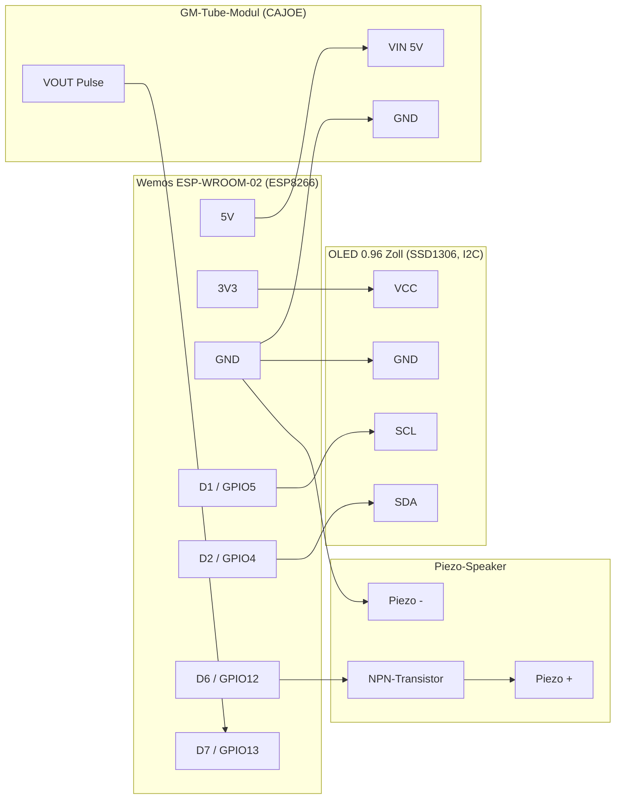

# Verkabelung

> ⚠️ Das GM-Tube-Modul in diesem Diagramm ist mittlerweile die **selbstgebaute HV-Schaltung** aus [06-hv-circuit.md](06-hv-circuit.md) (nicht mehr das CAJOE-Fertigmodul) – Schnittstelle nach außen (5V-Versorgung rein, Pulsausgang raus) ist aber identisch geblieben, das Diagramm unten gilt unverändert. **Sicherheitshinweise in 06-hv-circuit.md vor dem Aufbau lesen.**

## Pinbelegung Wemos ESP-WROOM-02

| Board-Pin | ESP8266-GPIO | Funktion im Projekt |
|---|---|---|
| 5V | – (TP5400-Boost-Ausgang) | Versorgung GM-Tube-Modul |
| 3V3 | – | Versorgung OLED |
| GND | – | Gemeinsame Masse |
| D1 | GPIO5 | I2C SCL (OLED) |
| D2 | GPIO4 | I2C SDA (OLED) |
| D7 | GPIO13 | Pulseingang GM-Tube-Modul (ESPGeiger-Default für ESP8266) |
| D6 | GPIO12 | Buzzer-Ansteuerung (über Transistor) |

## Verbindungsdiagramm

## Hinweise

- Alle GND-Verbindungen (Board, GM-Tube-Modul, OLED, Buzzer) müssen auf ein gemeinsames Massepotential.
- Der Transistor zwischen D6 und dem Piezo-Element schützt den GPIO-Pin vor Überlastung und erlaubt später den Wechsel auf einen etwas kräftigeren Speaker, ohne die Ansteuerung zu ändern.
- Vor dem ersten Einschalten: Alle Verbindungen mit Multimeter auf Kurzschluss prüfen (insbesondere 5V/GND und 3V3/GND).
