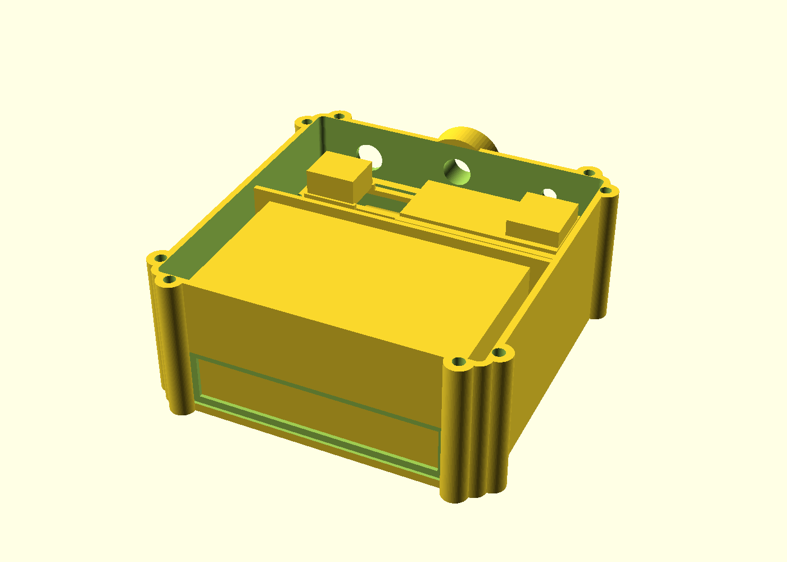

# Gehäuse

## Referenz und aktueller V2-Stand

Das ursprüngliche V1-Gehäuse orientierte sich am [Case for Cajoe Geiger Counter (Thingiverse, greygoo)](https://www.thingiverse.com/thing:5982201). Für IceGeiger V2 wird die fremde STL-Geometrie **nicht übernommen**. Das aktuelle Gehäuse ist vollständig eigenständig und parametrisch in OpenSCAD modelliert.

Aktueller V2-Druckstand:

- `hardware/v2/field_case_v151/IceGeiger_FieldCase_v1.5.1_COMPLETE.scad`
- GC-1602-NANO Messkammer
- HITT/Heltec Wireless Tracker V1.2 mit SX1262 + UC6580
- **real vermessenes duales 18650 Battery Shield, 100,2 × 48,0 mm**
- gemessene Shield-Lochmitten in Längsrichtung: **97,0 mm**
- Shield-Auflageschienen nach Passformtest auf **90,0 mm** gekürzt
- 2× wechselbare Samsung INR18650-25R
- microSD
- außenliegende 868-MHz-SMA-Antenne
- beide Displays sichtbar
- umlaufende 2-mm-Silikon-Dichtung
- Beta-Messfenster mit dünner Membran und abnehmbarer Schutzkappe
- 12-mm-Aufhängeöse für Seil/Drone-Sling
- separates Kontrastfarbteil mit Radioaktivsymbol und `IceGeiger`

## v1.5.1 Battery-Shield-Integration

Der erste reale Passformtest zeigte, dass die Auflageschienen des Battery Shields nur **90 mm** lang sein dürfen. Das ist in v1.5.1 umgesetzt. Bei 100,2 mm PCB-Länge bleiben damit etwa **5,1 mm Freiraum an jedem Ende**.

Die Befestigungsbohrungen liegen längs **97,0 mm** auseinander. Statt die noch nicht vermessene Y-Position zu raten, besitzt der Boden vier **10 × 10 mm** große Insert-Auflagen an den 97-mm-X-Achsen. Das reale Shield dient beim Einbau als Bohr-/Heat-Insert-Schablone.

Die reale Unterseite des Shields besitzt ein bis zu ca. 5 mm hohes Bauteil; der Entwurf hält dafür rechnerisch ca. **1,2 mm Freiraum zum Gehäuseboden**.

Oberhalb des Shields sitzt eine herausnehmbare Service-Brücke für Tracker und microSD. Die eingelöteten Tracker-Pinreihen hängen in offene Schlitze und die GNSS-Patchantenne erhält eine offene Zone unter sich.

Zusätzlich besitzt die Zwischenwand zwei **10 × 10 mm** Kabeldurchführungen und die Shield-Seite eine **11-mm** Kabel-/Stromdurchführung.

Die älteren `field_case_v14/`- und `field_case_v12/`-Geometrien bleiben als Historie erhalten.

## Rear Badge v1.5.3 – ACE Pro

Für den Kobra S1 + ACE Pro gibt es unter `hardware/v2/field_case_v151/badge_v153/` eine echte Zweifarben-Version des Badges:

- Hintergrund als eigener schwarzer Körper
- Radioaktivsymbol + `IceGeiger` als eigener gelber Körper
- gemeinsame Koordinaten für Multi-Part-Import
- 0,40-mm-Verzahnung zwischen beiden Materialien
- 0,90 mm sichtbar erhabenes Logo/Schrift
- Multi-Part-3MF für Anycubic Slicer Next

`badge_v152/` bleibt historisch erhalten und enthält noch den supersedierten Schriftzug `IceDrone`.

## OpenSCAD / STL / PNG

`field_case_v151/` enthält ein Master-CAD und einzelne OpenSCAD-Dateien für Base, Lid, Service Bridge, Beta Cap, Rear Badge und Gasket Jig. Die Einzeldateien laden die Master-SCAD aus demselben Ordner und wählen nur das jeweilige Druckteil aus.

GitHub Actions erzeugt daraus automatisch die einzelnen STL-Dateien und PNG-Vorschauen sowie Komplett-, Layout- und beschriftete Explosionsansichten. Für Badge v1.5.3 werden zusätzlich die zwei ACE-STLs, eine einfarbige STL, Preview-PNGs und eine Multi-Part-3MF erzeugt.

## Abmessungen und Status

Der CAD-Hauptkörper ist **130 × 132 × 58 mm**, der Deckel 4,2 mm.

Der Tracker und das Battery Shield sind anhand realer Hardware bzw. realer Messwerte berücksichtigt. Beim GC-1602 wird bis zur physischen Vermessung weiterhin die Amazon-Angabe **108 × 65 × 47 mm** verwendet.

Damit der aktuelle Druck trotzdem nicht von erfundenen GC-Bohrmaßen abhängt, sind die GC-Eckhalter als breite, ungebohrte Pads ausgeführt. Das reale Board wird trocken aufgelegt und anschließend durch sein echtes Lochbild gebohrt.

## Drone-Aufhängung

An der oberen/hinteren Gehäusewand sitzt eine verstärkte Öse mit **12 mm freier Öffnung**. Sie ist als Haltepunkt für ein dickes Seil bzw. einen Drone-Sling vorgesehen.

Die Öse ist FDM-gedruckt und kein zertifiziertes Flugbauteil. Vor einem Flug statisch mit Mehrfachlast testen und bei den ersten Versuchen ein unabhängiges Sicherungsseil verwenden.

## Dichtung und Beta-Fenster

Die Hauptfuge enthält eine 2,45 mm breite und 1,55 mm tiefe Nut für 2,0-mm-Silikonrundschnur. Acht M3-Schrauben verteilen den Anpressdruck. Beide Displayöffnungen erhalten von innen verklebte 1-mm-Polycarbonatfenster.

Die Zählrohrseite besitzt ein Beta-Messfenster mit dünner PET/Mylar-Membran und abnehmbarer Schutzkappe.

Das Design ist auf **Spritzwasserschutz** ausgelegt, besitzt aber keine geprüfte IP-Schutzart.

## Kollisionsprüfung

`hardware/v2/field_case_v151/check_fit.py` prüft die wichtigsten konservativen Freiräume und die 90-mm-/97-mm-Shield-Geometrie.
