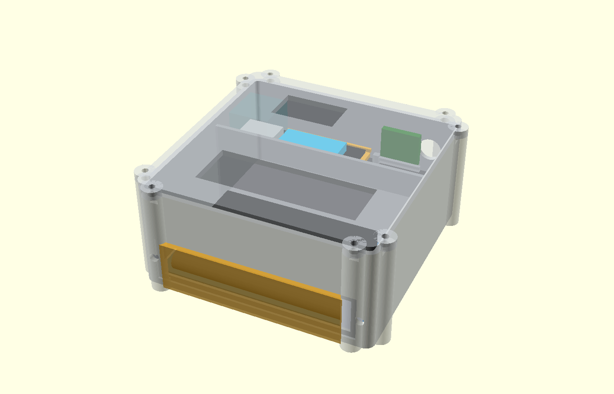
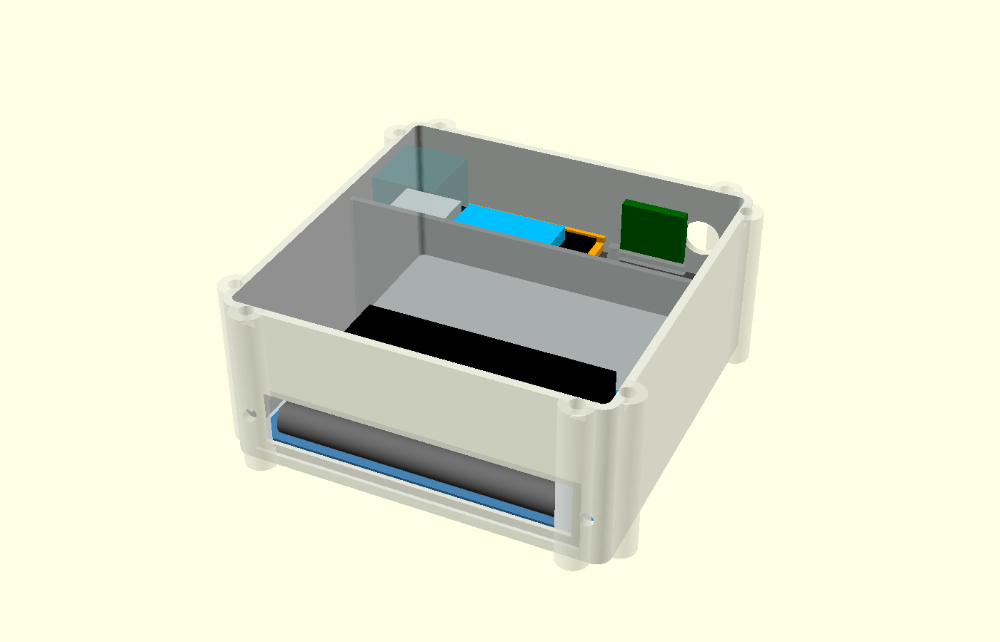

# Gehäuse

## Referenz und aktueller V2-Stand

Das ursprüngliche V1-Gehäuse orientierte sich am [Case for Cajoe Geiger Counter (Thingiverse, greygoo)](https://www.thingiverse.com/thing:5982201). Für IceGeiger V2 wird die fremde STL-Geometrie **nicht übernommen**. Stattdessen gibt es ein vollständig eigenständiges, parametrisierbares OpenSCAD-Gehäuse ohne externe Bibliotheken.

Aktueller V2-Entwurf:

- `hardware/v2/field_case_v12/icegeiger_field_case_v12.scad`
- GC-1602-NANO Messkammer
- HITT/Heltec Wireless Tracker V1.2 mit SX1262 + UC6580
- 2× wechselbare Samsung INR18650-25R in 1S2P
- microSD, 1S-BMS und 5-V-Regler
- außenliegende 868-MHz-SMA-Antenne
- beide Displays sichtbar
- umlaufende 2-mm-Silikon-Dichtung
- Beta-Messfenster mit dünner Membran und abnehmbarer Schutzkappe

## Abmessungen und Status

Der Hauptkörper ist derzeit **120 × 120 × 54 mm**, der Deckel 4,2 mm. Mit den acht außenliegenden M3-Klemmbossen ergibt sich eine maximale STL-Hüllfläche von etwa **130,4 × 130,4 mm**.

Der gelieferte Tracker ist mechanisch verifiziert. Für den noch ausstehenden GC-1602 werden bis zur physischen Vermessung die Amazon-Angaben **108 × 65 × 47 mm** verwendet. Das bereitgestellte Printables-STL `GC-1602-NANO_CAJOE_1.1.stl` wurde nur als Plausibilitätsreferenz analysiert (119,05 × 71,00 × 28,80 mm) und wird nicht weiterveröffentlicht.

Die GC-bezogenen STL-Dateien bleiben deshalb **PRELIMINARY**. Nach Lieferung werden PCB-Maße, Bohrungen, Rohrposition und LCD-Höhe eingetragen; danach folgt der FINAL-Export.

## Dichtung und Beta-Fenster

Die Hauptfuge enthält eine 2,45 mm breite und 1,55 mm tiefe Nut für 2,0-mm-Silikonrundschnur (~22,5 % nominelle Kompression). Acht M3-Schrauben verteilen den Anpressdruck. Beide Displayöffnungen erhalten von innen verklebte 1-mm-Polycarbonatfenster.

Die Zählrohrseite besitzt ein **98 × 18 mm** großes Messfenster. Innen bleibt eine dünne PET/Mylar-Membran (Startwert 25–50 µm) dauerhaft abgedichtet; außen sitzt eine starre abnehmbare PETG/ASA-Schutzkappe. Für beta-sensitive Messungen wird nur die Kappe abgenommen.

Das Design ist auf **Spritzwasserschutz** ausgelegt, besitzt aber keine geprüfte IP-Schutzart.

## Kollisionsprüfung

`hardware/v2/field_case_v12/check_fit.py` prüft konservative Bauteilhüllen. Der aktuelle Stand ist kollisionsfrei. Wichtige Abstände: GC→Deckel 2,70 mm; Akkuhalter→Tracker-Pinspitzen 2,00 mm; Tracker→Deckel 8,19 mm; GC→Trennwand 2,00 mm; Akkuhalter→Innenwand mindestens 1,40 mm.

Details: `hardware/v2/field_case_v12/FIT_REPORT.md`.
