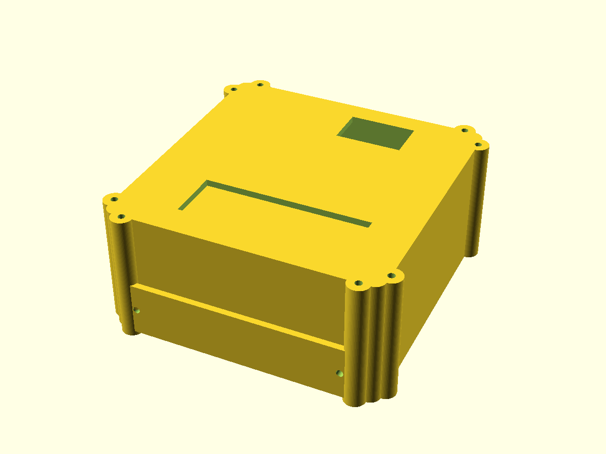
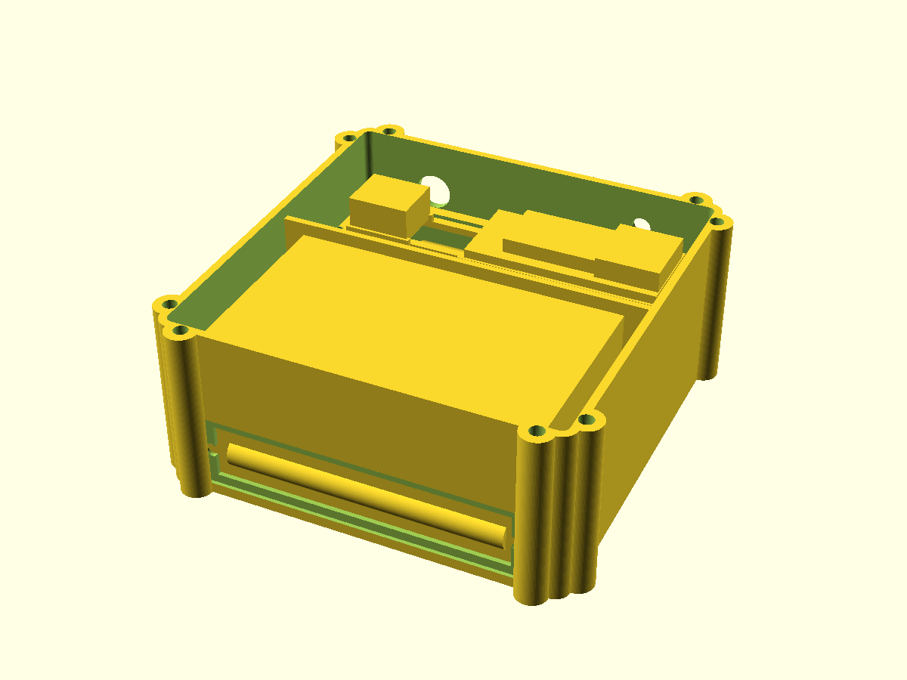

# Gehäuse

## Referenz und aktueller V2-Stand

Das ursprüngliche V1-Gehäuse orientierte sich am [Case for Cajoe Geiger Counter (Thingiverse, greygoo)](https://www.thingiverse.com/thing:5982201). Für IceGeiger V2 wird die fremde STL-Geometrie **nicht übernommen**. Das aktuelle Gehäuse ist vollständig eigenständig und parametrisch in OpenSCAD modelliert.

Aktueller V2-Druckstand:

- `hardware/v2/field_case_v14/icegeiger_field_case_v14.scad`
- GC-1602-NANO Messkammer
- HITT/Heltec Wireless Tracker V1.2 mit SX1262 + UC6580
- **real vermessenes duales 18650 Battery Shield, 100,2 × 48,0 mm**
- 2× wechselbare Samsung INR18650-25R
- microSD
- außenliegende 868-MHz-SMA-Antenne
- beide Displays sichtbar
- umlaufende 2-mm-Silikon-Dichtung
- Beta-Messfenster mit dünner Membran und abnehmbarer Schutzkappe

## v1.4 Battery-Shield-Integration

An beiden kurzen Shield-Rändern liegen im Gehäuse massive **5 × 5 mm Befestigungsschienen**. Die reale Unterseite des Shields besitzt ein bis zu ca. 5 mm hohes Bauteil; v1.4 hält dafür rechnerisch ca. **1,2 mm Freiraum zum Gehäuseboden**.

Oberhalb des Shields sitzt eine herausnehmbare Service-Brücke für Tracker und microSD. Die eingelöteten Tracker-Pinreihen hängen in offene Schlitze und die GNSS-Patchantenne erhält eine offene Zone unter sich.

Die alte `field_case_v12/`-Geometrie bleibt nur als Historie erhalten.

## Abmessungen und Status

Der CAD-Hauptkörper ist **130 × 132 × 58 mm**, der Deckel 4,2 mm. Mit den acht außenliegenden M3-Klemmbossen ergibt sich eine maximale STL-Hüllfläche von etwa **140,4 × 142,4 mm**.

Der Tracker und das Battery Shield sind anhand realer Hardware bzw. realer Messwerte berücksichtigt. Beim GC-1602 wird bis zur physischen Vermessung weiterhin die Amazon-Angabe **108 × 65 × 47 mm** verwendet.

Damit der aktuelle Druck trotzdem nicht von erfundenen GC-Bohrmaßen abhängt, sind die GC-Eckhalter als breite, ungebohrte Pads ausgeführt. Das reale Board wird trocken aufgelegt und anschließend durch sein echtes Lochbild gebohrt.

## Dichtung und Beta-Fenster

Die Hauptfuge enthält eine 2,45 mm breite und 1,55 mm tiefe Nut für 2,0-mm-Silikonrundschnur. Acht M3-Schrauben verteilen den Anpressdruck. Beide Displayöffnungen erhalten von innen verklebte 1-mm-Polycarbonatfenster.

Die Zählrohrseite besitzt ein Beta-Messfenster mit dünner PET/Mylar-Membran und abnehmbarer Schutzkappe.

Das Design ist auf **Spritzwasserschutz** ausgelegt, besitzt aber keine geprüfte IP-Schutzart.

## Kollisionsprüfung

`hardware/v2/field_case_v14/check_fit.py` prüft die wichtigsten konservativen Freiräume. Details: `hardware/v2/field_case_v14/FIT_REPORT.md`.
