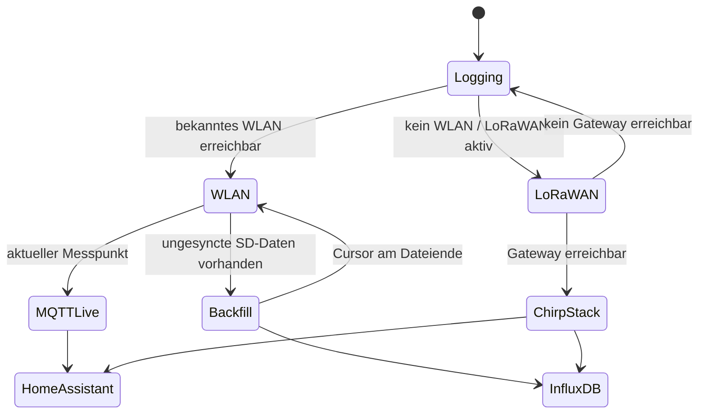

# V2 – Überblick und Designentscheidungen

## Ziel

IceGeiger V2 soll vier Anforderungen gleichzeitig erfüllen:

1. **stationäre Messung im Schuppen** mit Home-Assistant-Anbindung,
2. **mobiler Betrieb** mit zwei 18650-Zellen,
3. **GNSS-gekoppelte Offline-Aufzeichnung** aller Messpunkte auf microSD,
4. **LoRaWAN-Liveübertragung** unterwegs, sofern Gateway-Abdeckung vorhanden ist, plus automatischer WLAN-Nachsync nach Rückkehr.

## Warum der GC-1602-NANO als Messplattform bleibt

Der gekaufte GC-1602-NANO enthält bereits Hochspannungserzeugung, Zählrohranschluss, lokalen Arduino Nano, 1602-LCD und akustische Anzeige. Der V2-Controller ersetzt diese Funktionen nicht. Er liest nur den vorhandenen `INT`-Ausgang und arbeitet damit als unabhängige Telemetrie- und Logger-Erweiterung.

Vorteile:

- weniger Eingriff in die Hochspannungsschaltung,
- lokale Anzeige funktioniert auch ohne ESP32,
- Telemetriefehler beeinflussen die lokale Zählung nicht,
- die Schnittstelle kann mit Oszilloskop/Logikanalysator separat geprüft werden.

## Controller

Vorgesehen ist der **Heltec Wireless Tracker V2**. Das Board kombiniert:

- ESP32-S3,
- SX1262 LoRa,
- UC6580 GNSS,
- WLAN/Bluetooth,
- Lithium-Akku-Management,
- USB-C,
- Display.

Für IceGeiger werden zusätzlich eine microSD-Platine und der Pegelteiler für den GC-1602-INT benötigt.

## Datenmodell

Der Logger speichert den Rohwert möglichst verlustarm. Jede 10-s-Messung enthält mindestens:

| Feld | Bedeutung |
|---|---|
| `seq` | monotone lokale Sequenznummer |
| `ts` | UTC-Unixzeit aus GNSS, falls gültig |
| `counts_10s` | tatsächlich gezählte Pulse im 10-s-Fenster |
| `cpm_60s` | gleitender 60-s-CPM-Wert |
| `usvh` | abgeleiteter Wert mit konfiguriertem Faktor |
| `factor_cpm_per_usvh` | verwendeter Umrechnungsfaktor |
| `lat`, `lon` | GNSS-Koordinaten |
| `satellites`, `hdop` | GNSS-Qualität |
| `battery_mv` | Batteriespannung, wenn Hardwaremessung verifiziert ist |
| `gps_valid` | Kennzeichen, ob Position/Zeit gültig sind |

**CPM und Rohimpulse bleiben die primären Messwerte.** Der µSv/h-Wert wird mit gespeichert, aber nie ohne Kenntnis des verwendeten Faktors interpretiert.

## Datenwege

## Wichtige Einschränkung von LoRaWAN

LoRaWAN ist **kein Mobilfunkersatz**. Ein mobiler IceGeiger kann nur live senden, wenn ein Gateway des verwendeten LoRaWAN-Netzes erreichbar ist. Ein privates ChirpStack zuhause verarbeitet nur Frames von Gateways, die mit diesem ChirpStack verbunden sind. Für Fahrten weit außerhalb der Reichweite des eigenen Gateways braucht man entweder weitere eigene Gateways oder ein öffentliches/kommerzielles LoRaWAN-Netz.

Genau deshalb ist die SD-Aufzeichnung der maßgebliche Datenpfad; LoRaWAN ist Live-Telemetrie, nicht die einzige Datenhaltung.
