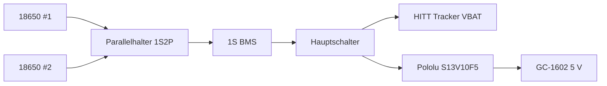

# V2 – BOM / Einkaufsliste

Stand: 2026-09-12. Ziel ist ein kompakter mobiler Aufbau mit GC-1602-NANO, HITT-Tracker, LoRaWAN/GNSS, Offline-Logging und zwei wechselbaren 18650-Zellen.

## Bereits vorhanden / bestellt

| Pos. | Bauteil | Menge | Status / Spezifikation |
|---|---|---:|---|
| 1 | GC-1602-NANO Geiger Counter Kit inkl. Zählrohr | 1 | bestellt: https://amzn.eu/d/0cK2H3rO; Verkäufer nennt 108 × 65 × 47 mm |
| 2 | HITT/Heltec Wireless Tracker V1.2 | 1 | vorhanden; SX1262 + UC6580; 65,84 × 28,00 × 14,71 mm |
| 3 | Samsung INR18650-25R | 2 | vorhanden; wechselbare Zellen, 1S2P |

## Noch zu beschaffen

| Pos. | Bauteil | Menge | Festlegung / Zweck |
|---|---|---:|---|
| 4 | Batteriehalter 2×18650 **parallel** | 1 | 76 × 40,5 × 20 mm; Jan Friedrich Elektronikversand oder dimensionsgleich |
| 5 | 1S-BMS 3,7 V / 4 A | 1 | z. B. Funduino F23108292, 30,1 × 3,6 × 2 mm; Schutz der ungeschützten 25R |
| 6 | Pololu S13V10F5 | 1 | 2,8–22 V → feste 5 V, typisch 1 A; 8,9 × 12,1 × 4,2 mm; Versorgung GC-1602 |
| 7 | Joy-IT COM-MSD | 1 | 3,3-V-SPI, 18 × 21 × 12 mm; Offline-Logging |
| 8 | microSD-Karte | 1 | 16–32 GB High-Endurance/Industrial bevorzugt |
| 9 | Widerstand 10 kΩ, 1 % | 1 | GC-INT-Pegelteiler oben |
| 10 | Widerstand 20 kΩ, 1 % | 1 | GC-INT-Pegelteiler unten |
| 11 | Hauptschalter | 1 | rastender abgedichteter M12-Schalter, >=2 A DC |
| 12 | U.FL/IPEX → SMA-Female Bulkhead | 1 | 5–10 cm, 50 Ω; LoRa-Antenne außen |
| 13 | 868-MHz-SMA-Antenne | 1 | etwa 2 dBi; EU868 |
| 14 | 2-mm-Silikon-Rundschnur | ~0,6 m | Hauptgehäusedichtung |
| 15 | 1-mm-Polycarbonat | 2 Fenster | von innen für beide Displays |
| 16 | PET/Mylar-Folie 25–50 µm | 1 Stück | Beta-Membran vor dem Zählrohr |
| 17 | M3 Heat-Set Inserts | 10–12 | Hauptdeckel + Beta-Kappe |
| 18 | M3×8/M3×10 Edelstahl | 10–12 | Gehäuseverschraubung |
| 19 | PETG oder ASA | ~300–400 g | Gehäuse, Tracker-Shelf, Beta-Kappe |

## Stromversorgung

Die beiden 25R werden **parallel**, nicht seriell betrieben. Vor dem gemeinsamen Einsetzen müssen beide Zellen nahezu die gleiche Leerlaufspannung haben. Beim ausgewählten Parallelhalter ist laut Händler eine Polaritätsmarkierung auf einer Seite falsch; deshalb vor Anschluss die reale Polarität mit dem Multimeter prüfen.

## LoRaWAN-Infrastruktur

Für privaten ChirpStack-Betrieb wird ein echtes EU868-Multichannel-Gateway benötigt (SX1302/SX1303 oder vergleichbarer Concentrator). Ein SX1262-Endgerät ist kein Gateway.
