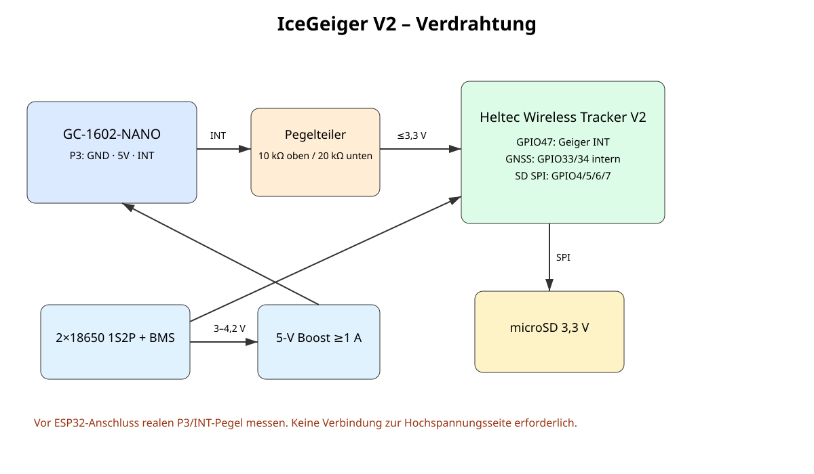
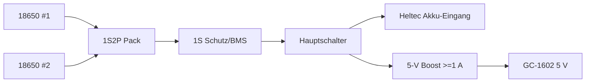

# V2 – Elektrik und Verdrahtung

## 1. GC-1602-INT an ESP32
Auf den Produktbildern ist am GC-1602 ein dreipoliger Anschluss `P3` mit `GND`, `5V`, `INT` erkennbar. Für V2 werden nur `GND` und `INT` benutzt. Der ESP32 arbeitet mit 3,3-V-Logik, deshalb wird der INT-Pin **nicht direkt** verbunden.

### Pegelteiler
- GC-1602 `INT` → **10 kΩ** → ESP32 GPIO47
- ESP32 GPIO47 → **20 kΩ** → GND
- GC-1602 `GND` → ESP32 `GND`

Bei 5 V Eingang ergibt der ideale Teiler `5 V × 20 kΩ / (10 kΩ + 20 kΩ) = 3,33 V`. **Vor Anschluss an den ESP32 den realen INT-Pegel des gelieferten Boards mit Multimeter/Oszilloskop messen.**

## 2. microSD
| microSD | ESP32-S3 |
|---|---|
| SCK | GPIO4 |
| MISO | GPIO5 |
| MOSI | GPIO6 |
| CS | GPIO7 |
| VCC | 3V3 |
| GND | GND |

Die Firmware nutzt dafür einen separaten SPI-Bus. Leitungen kurz halten; bei instabiler Kommunikation SPI-Takt reduzieren. Die freien Pins müssen am konkreten Wireless-Tracker-V2-Boardstand vor endgültiger Verdrahtung nochmals geprüft werden.

## 3. GNSS
Das UC6580 ist auf dem Wireless Tracker V2 integriert. Vorgesehen sind GNSS UART RX am ESP32 GPIO33, TX GPIO34 und Power-Control GPIO3. Keine externe GPS-Platine ist erforderlich.

## 4. Versorgung

Nur gleiche Zellen gleichen Alters/Kapazität verwenden, vor Parallelschalten nahezu gleiche Leerlaufspannung herstellen, Schutz/BMS nutzen und Pack mechanisch gegen Kurzschluss sichern.

## 5. Störungsminimierung
Kurze gemeinsame Masse; GNSS-Antenne weg von HV-Spule/Boost; LoRa-Antenne nicht direkt neben Akkus/Metall; SD-Leitungen kurz; 5-V-Boost nicht unmittelbar am Zählrohr/HV-Teil.

## 6. Erstprüfung
1. GC-1602 allein über 5 V testen.
2. INT gegen GND messen: Ruhepegel und Pulshöhe dokumentieren.
3. Pegelteiler ohne ESP32 aufbauen und Ausgang prüfen.
4. Erst wenn am GPIO-Knoten sicher ≤3,3 V anliegen, ESP32 verbinden.
5. Gemeinsame Masse prüfen.
