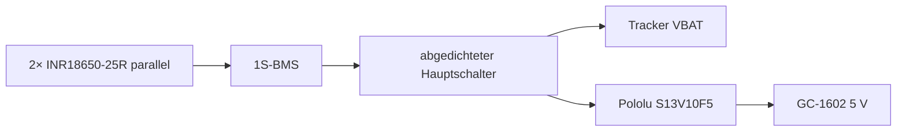

# V2 – Elektrik und Verdrahtung

## Gelieferter Tracker

Das reale Board ist mit **HITT-Tracker V1.2** beschriftet. Auf der Rückseite sind **SX1262** und **UC6580** eindeutig erkennbar. Die öffentliche Heltec-Dokumentation der V1.1-Familie nennt ESP32-S3FN8, SX1262, UC6580, Type-C, Lithium-Akkuinterface und dieselbe GNSS-/LoRa-Architektur.

Wichtige belegte Pins der V1.1-Familie:

- GPIO33 = GNSS_TX → ESP32 RX
- GPIO34 = GNSS_RX → ESP32 TX
- GPIO3 = Vext/GNSS power control
- GPIO8…14 = LoRa
- GPIO38…42 = TFT

## GC-1602-INT an ESP32

Der erste Entwurf nutzte GPIO47. Laut Heltec-Pinout ist GPIO47 als Boot-Mode-Pin belegt. Für die reale Tracker-Familie wird deshalb **GPIO17** verwendet.

- GC-1602 `INT` → **10 kΩ** → ESP32 **GPIO17**
- GPIO17 → **20 kΩ** → GND
- GC-1602 `GND` → Tracker `GND`

Bei 5 V Eingang liefert der ideale Teiler etwa 3,33 V. Vor Anschluss den realen INT-Pegel des gelieferten GC-1602 messen. Gezählt wird auf der **fallenden Flanke**.

## microSD

| Joy-IT COM-MSD | Tracker |
|---|---|
| CLK | GPIO4 |
| MISO | GPIO5 |
| MOSI | GPIO6 |
| CS | GPIO7 |
| VCC | 3V3 |
| GND | GND |

GPIO4–7 sind im dokumentierten Tracker-Pinout frei von LoRa/TFT. Leitungen kurz halten.

## GNSS

```cpp
pinMode(3, OUTPUT);
digitalWrite(3, HIGH);
Serial1.begin(115200, SERIAL_8N1, 33, 34);
```

GPIO33 ist MCU-RX vom UC6580-TX, GPIO34 MCU-TX zum UC6580-RX.

## Akku und 5-V-Zweig



Der Tracker besitzt eigenes Lithium-Lademanagement. Der externe BMS schützt das **gesamte 1S2P-Pack** der ungeschützten 25R. Der Pololu-Regler hat keinen Verpolschutz; Polarität vor Erstanschluss prüfen.

## Batterie-Messung

Heltec dokumentiert für GPIO1 `VBAT = Vbat_Read × 4.9`. Die Firmware liest GPIO1 und veröffentlicht den daraus berechneten Batteriewert. Bei Inbetriebnahme gegen ein Multimeter prüfen und falls nötig kalibrieren.

## HF/GNSS-Anordnung

Der Tracker wird im Gehäuse um 180° gedreht, damit die GNSS-Patchantenne über einem **22 × 24 mm metallfreien Hohlraum** sitzt und nicht direkt über den Stahlhüllen der 18650. LoRa wird über ein kurzes U.FL→SMA-Pigtail zu einer abgedichteten SMA-Durchführung geführt.
