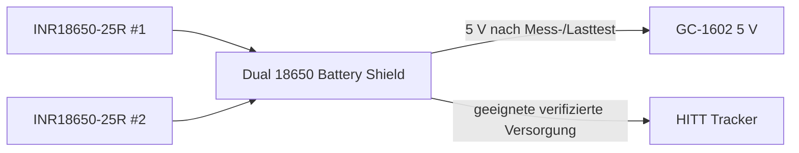

# V2 – Elektrik und Verdrahtung

## Gelieferter Tracker

Das reale Board ist mit **HITT-Tracker V1.2** beschriftet. Auf der Rückseite sind **SX1262** und **UC6580** eindeutig erkennbar. Die öffentliche Heltec-Dokumentation der V1.1-Familie nennt ESP32-S3FN8, SX1262, UC6580, Type-C, Lithium-Akkuinterface und dieselbe GNSS-/LoRa-Architektur.

Wichtige belegte Pins der V1.1-Familie:

- GPIO33 = GNSS_TX → ESP32 RX
- GPIO34 = GNSS_RX → ESP32 TX
- GPIO3 = Vext/GNSS power control
- GPIO8…14 = LoRa
- GPIO38…42 = TFT

## GC-1602-INT an ESP32

Für die reale Tracker-Familie wird **GPIO17** verwendet.

- GC-1602 `INT` → **10 kΩ** → ESP32 **GPIO17**
- GPIO17 → **20 kΩ** → GND
- GC-1602 `GND` → Tracker `GND`

Bei 5 V Eingang liefert der ideale Teiler etwa 3,33 V. Vor Anschluss den realen INT-Pegel des gelieferten GC-1602 messen. Gezählt wird auf der **fallenden Flanke**.

Gemessen (19.09.2026, Nano-Pin D2 gegen GND, USB-Versorgung über den Nano): Ruhepegel **4,39 V**. Der Teiler liefert dann ca. 2,93 V am GPIO (ESP32-S3: High ab etwa 2,5 V, maximal 3,6 V). Bei 5,0 V Schienenspannung sind es 3,33 V, bei 5,25 V ca. 3,5 V. Der Pegel folgt der Versorgung; deshalb nach dem Umstieg auf das Battery Shield erneut messen.

## microSD

| microSD SPI | Tracker |
|---|---|
| CLK | GPIO4 |
| MISO | GPIO5 |
| MOSI | GPIO6 |
| CS | GPIO7 |
| VCC | 3V3 |
| GND | GND |

GPIO4–7 sind im dokumentierten Tracker-Pinout frei von LoRa/TFT. Leitungen kurz halten.

## GNSS

```cpp
pinMode(3, OUTPUT);
digitalWrite(3, HIGH);
Serial1.begin(115200, SERIAL_8N1, 33, 34);
```

GPIO33 ist MCU-RX vom UC6580-TX, GPIO34 MCU-TX zum UC6580-RX.

## Aktueller Akku-/5-V-Zweig – Battery Shield

Field Case v1.4 ersetzt den separaten 1S2P-Halter, BMS und Pololu-Boost mechanisch durch das vorhandene duale 18650 Battery Shield.



Das reale Shield ist mechanisch mit **100,2 × 48,0 mm** vermessen. Optisch entspricht es der DFR0969/OKY3604-2-artigen Powerbank-Shield-Familie mit HOLD/NORMAL, Ladeelektronik, Schutz und 5-V-Ausgang. Weil Clone-Revisionen variieren, werden diese elektrischen Funktionen **vor Anschluss** mit Multimeter und Last geprüft und nicht nur aus dem Aussehen abgeleitet.

### Erstinbetriebnahme des Battery Shields

1. beide 25R einzeln messen und nur bei nahezu gleicher Zellspannung gemeinsam einsetzen,
2. Polarität der beiden Schächte gegen die PCB-Markierung prüfen,
3. Shield ohne IceGeiger einschalten,
4. 5-V-Ausgang messen,
5. Testlast anschließen und Spannung/Strom/Temperatur beobachten,
6. NORMAL/HOLD testen,
7. Ruhestrom in HOLD messen,
8. erst danach GC-1602 und Tracker anschließen.

Hinweis: Bei einigen Shields dieser Bauart erzwingt HOLD den Dauerbetrieb mittels Zusatzlast. Das verhindert das Powerbank-Auto-Off, erhöht aber den Ruhestrom. Für den Schuppenbetrieb muss der reale Verbrauch deshalb gemessen werden.

## Batterie-Messung

Heltec dokumentiert für GPIO1 `VBAT = Vbat_Read × 4.9`. Ob GPIO1 in der finalen Battery-Shield-Versorgung weiterhin die reale Zellspannung sinnvoll abbildet, wird beim Verdrahtungstest gegen das Multimeter geprüft. Falls nicht, wird die Firmware-Skalierung bzw. der Messpunkt angepasst.

## HF/GNSS-Anordnung

Der Tracker sitzt auf der herausnehmbaren Service-Brücke oberhalb des Battery Shields. Unter der GNSS-Patchantenne ist der Bridge-Bereich offen. LoRa wird über ein kurzes U.FL→SMA-Pigtail zu einer abgedichteten SMA-Durchführung geführt.
