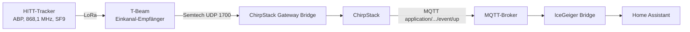

# V2 – LoRaWAN + ChirpStack Schritt für Schritt

## 0. Was LoRaWAN hier leistet

LoRaWAN transportiert kleine Live-Telemetriepakete. Es ersetzt **nicht** die SD-Karte und funktioniert nur in Reichweite eines passenden Gateways.

Für Deutschland wird IceGeiger als **EU863-870 / EU868** konfiguriert. Die Firmware sendet bewusst deutlich seltener als die lokale 10-s-Aufzeichnung.

## 1. Gateway vorbereiten

Benötigt wird ein echter Multi-Channel-LoRaWAN-Concentrator, z. B. SX1302/SX1303-basierend, EU868.

Gateway so konfigurieren, dass es mit dem eigenen ChirpStack spricht:

- bevorzugt LoRa Basics Station oder
- ChirpStack Gateway Bridge.

Ein normales SX1262-Endgerät kann diesen Gateway-Concentrator nicht ersetzen.

## 2. ChirpStack per Docker installieren

Empfohlener Weg ist das offizielle Docker-Beispielprojekt von ChirpStack.

```bash
git clone https://github.com/chirpstack/chirpstack-docker.git
cd chirpstack-docker
docker compose up -d
```

Danach Weboberfläche öffnen und:

1. Tenant anlegen bzw. Default-Tenant nutzen.
2. EU868 Device Profile anlegen.
3. Application `IceGeiger` anlegen.
4. Gateway mit seiner Gateway-ID registrieren.
5. Endgerät registrieren.

## 3. OTAA-Endgerät anlegen

In ChirpStack:

- Device Profile: LoRaWAN Class A, Region EU868,
- Device Name: `icegeiger-v2`,
- DevEUI: aus lokaler `secrets.h`,
- JoinEUI/AppEUI: passend zur Konfiguration,
- AppKey: **nur lokal und in ChirpStack**, niemals ins öffentliche GitHub-Repo.

## 4. Payload Codec hinterlegen

Den Inhalt von `integrations/chirpstack/codec.js` als JavaScript Payload Codec für das Device Profile bzw. die Application konfigurieren.

Der Decoder liefert u. a.:

- `seq`
- `timestamp`
- `cpm`
- `counts_10s`
- `latitude`
- `longitude`
- `battery_mv`
- `satellites`
- `hdop`
- `factor_cpm_per_usvh`
- `usvh`

## 5. MQTT prüfen

ChirpStack veröffentlicht Uplinks standardmäßig auf einem Topic nach dem Muster:

`application/<APPLICATION_ID>/device/<DEV_EUI>/event/up`

Test:

```bash
mosquitto_sub -h <MQTT-HOST> -t 'application/+/device/+/event/up' -v
```

## 6. IceGeiger Bridge starten

Die Bridge verarbeitet sowohl ChirpStack-Uplinks als auch direkte WLAN-Publishes.

```bash
cd integrations/bridge
cp .env.example .env
# .env lokal editieren
docker compose up -d --build
```

## 7. Uplink-Strategie

Defaultwerte im Projekt:

| Modus | LoRaWAN Intervall |
|---|---:|
| WLAN verfügbar / Schuppen | 900 s Heartbeat |
| mobil ohne WLAN | 120 s |
| SD Logging | 10 s unabhängig davon |

Die Intervalle können angepasst werden. Höhere Sendehäufigkeit erhöht Energieverbrauch und Airtime und ist regulatorisch/netzseitig begrenzt.

## 8. Sendeleistung

Der Wireless Tracker V2 kann hardwareseitig eine hohe Ausgangsleistung bereitstellen. Für EU868 darf die Firmware **nicht einfach die maximale Hardwareleistung verwenden**. Regionale LoRaWAN-/ETSI-Grenzen und Antennengewinn müssen eingehalten werden. Das Projekt verlässt sich auf die EU868-Konfiguration des LoRaWAN-Stacks und dokumentiert keine 28-dBm-Nutzung für Deutschland.

## 9. Reichweite realistisch bewerten

Ein Gateway im Schuppen oder Haus kann je nach Antennenhöhe, Bebauung und Gelände von einigen hundert Metern bis mehreren Kilometern reichen; eine konkrete Reichweite lässt sich vor Ort nicht seriös vorhersagen.

Für Fahrten außerhalb der eigenen Gateway-Abdeckung:

- SD bleibt vollständig,
- WLAN-Backfill erfolgt nach Rückkehr,
- Live-LoRaWAN erfordert ein Netz/Gateway, das die Route tatsächlich abdeckt.

## 10. Testaufbau: T-Beam als Einkanal-Gateway (nur Uplink, ABP)

Für den ersten Funktionstest ohne echtes Multi-Channel-Gateway dient ein **LILYGO T-Beam** als Einkanal-Empfänger. Das ist **kein LoRaWAN-konformes Gateway**:

- empfängt nur auf **868,1 MHz, SF9 / 125 kHz** (DR3), keine Downlinks,
- deshalb **ABP statt OTAA** (ein Join braucht ein Downlink),
- nur für Tests gedacht. Für den Betrieb wird weiterhin ein Multi-Channel-Gateway (Abschnitt 1) mit OTAA verwendet.



### 10.1 ChirpStack und Provisionierung

Deployment und Skript: [integrations/chirpstack](../../integrations/chirpstack/README.md). Nach `provision.py` existieren Application `IceGeiger`, das Gateway, ein ABP-Gerät `icegeiger-v2` (gleicher Name wie das WLAN-Gerät, dadurch nutzen beide Übertragungswege dieselben Home-Assistant-Entities) und der Codec aus `integrations/chirpstack/codec.js`.

### 10.2 Gateway-Firmware (T-Beam)

Quelle: [firmware/tbeam_singlechannel_gateway](../../firmware/tbeam_singlechannel_gateway/tbeam_singlechannel_gateway.ino). `secrets.h` (WLAN, Adresse der Gateway Bridge) wird lokal aus `secrets.example.h` erzeugt.

- erkennt Netz-/Funkbaustein selbst (getestet: **T-Beam v1.2, AXP2101, SX1276, 868 MHz**),
- Gateway-EUI wird aus der WLAN-MAC gebildet (`xx:xx:xx:ff:fe:xx:xx:xx`) und muss in ChirpStack als Gateway angelegt sein,
- leitet Frames als Semtech-UDP `PUSH_DATA` weiter, sendet `PULL_DATA` als Keep-alive und alle 30 s Statistik.

Bekannte Fallen, die beim Test aufgetreten sind:

- `WiFi.macAddress()` liefert vor dem Start des WLAN-Stacks nur Nullen; die EUI muss über `esp_read_mac` gebildet werden.
- Die Frequenz muss als `868.1` (double) im JSON stehen. Als `float` ergibt sich `868.099976` und ChirpStack meldet `No channel found for frequency`.

**Meshtastic-Gateway sichern und wiederherstellen:** Wird ein T-Beam mit Meshtastic dafür überschrieben, vorher ein vollständiges Flash-Abbild und den Konfigurationsexport sichern (`esptool read-flash 0 0x400000 backup.bin`, `meshtastic --export-config`). Die Dateien enthalten Kanalschlüssel und gehören nicht ins Repository. Wiederherstellung: `esptool write-flash 0 backup.bin`.

### 10.3 Tracker-Firmware im ABP-Modus

In der lokalen `secrets.h`:

```cpp
#define ICEGEIGER_LORAWAN_ABP 1
static const uint32_t ICEGEIGER_DEV_ADDR = 0x........;     // aus geiger_device.json
static const uint8_t ICEGEIGER_NWK_S_KEY[16] = { ... };
static const uint8_t ICEGEIGER_APP_S_KEY[16] = { ... };
#define ICEGEIGER_LORA_TEST_INTERVAL_MS 60000               // nur Testbuild
```

Im ABP-Modus nutzt die Firmware ausschließlich Kanal 0 (868,1 MHz), DR3, ADR aus. Die Frame-Zähler beginnen nach jedem Neustart bei 0, deshalb ist am Gerät in ChirpStack **`skipFcntCheck`** gesetzt (macht `provision.py`). Ohne AppKey/DevAddr sendet der Tracker nicht.

Das Testintervall von 60 s entspricht bei diesem Payload (34 Byte, SF9) etwa 0,4 % Airtime und bleibt unter der 1-%-Grenze des Sub-Bands. Für den Betrieb gelten die Intervalle aus Abschnitt 7.

### 10.4 Ergebnis (19.09.2026)

- Der Tracker sendet, der T-Beam empfängt (34 Byte, RSSI und SNR im Nahbereich sehr hoch).
- ChirpStack dekodiert den Uplink mit dem Codec, MQTT-Event `application/<id>/device/<devEui>/event/up` vorhanden.
- Die Bridge übernimmt die Werte, die Home-Assistant-Entities aktualisieren sich.

Nicht getestet: OTAA-Join, Multi-Channel-Empfang, Downlinks, Reichweite.
