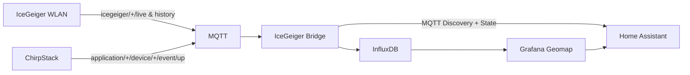

# V2 – Home Assistant, MQTT, InfluxDB und Karte

## Zielarchitektur



## Warum eine Bridge

Home Assistant kann Livewerte hervorragend per MQTT empfangen. Historische GPS-Punkte, die erst nach der Rückkehr hochgeladen werden, sollen aber ihren **ursprünglichen Zeitstempel** behalten. Deshalb schreibt die Bridge Backfill-Daten zusätzlich direkt nach InfluxDB.

## 1. MQTT in Home Assistant

Mosquitto-Broker/Add-on bzw. vorhandenen Broker einrichten und die Home-Assistant-MQTT-Integration verbinden.

Die Bridge veröffentlicht retained Discovery-Konfiguration unter:

- `homeassistant/sensor/<device>_cpm/config`
- `homeassistant/sensor/<device>_usvh/config`
- `homeassistant/sensor/<device>_satellites/config`
- `homeassistant/device_tracker/<device>/config`

Live-State liegt unter:

- `icegeiger_ha/<device>/state`
- `icegeiger_ha/<device>/location`

## 2. Device Tracker

Die Location-Payload enthält:

```json
{"latitude":48.1,"longitude":11.6,"gps_accuracy":5}
```

Damit kann Home Assistant den aktuellen Standort als MQTT Device Tracker anzeigen.

## 3. InfluxDB

In `.env` der Bridge eintragen:

- `INFLUX_URL`
- `INFLUX_ORG`
- `INFLUX_BUCKET`
- `INFLUX_TOKEN`

Die Bridge schreibt Messpunkte mit dem im Payload enthaltenen Originalzeitstempel. `transport` ist absichtlich ein Feld und kein Tag; dadurch landen Live- und Backfill-Version desselben 10-s-Punkts bei gleichem Gerät/Zeitstempel auf demselben Influx-Punkt statt als doppelte Kartenpunkte. Tag:

- `device`

Felder u. a.:

- `transport` (`wifi-live`, `wifi-history`, `lorawan`)

- `cpm`
- `counts_10s`
- `usvh`
- `lat`
- `lon`
- `satellites`
- `hdop`
- `battery_mv`
- `seq`

## 4. Grafana Geomap

InfluxDB als Data Source hinzufügen. Beispiel-Flux-Abfrage:

```flux
from(bucket: "icegeiger")
  |> range(start: -24h)
  |> filter(fn: (r) => r._measurement == "radiation")
```

Für Geomap sollten Latitude/Longitude und Strahlungswert in einer Tabelle zusammengeführt werden. Je nach Grafana-Version kann dazu eine Transformation/Pivot verwendet werden.

Empfehlung für die Karte:

- Location mode: Coordinates,
- Latitude: `lat`,
- Longitude: `lon`,
- Marker-Farbe: `cpm` oder `usvh`,
- Tooltip: Zeit, CPM, µSv/h, Satelliten, HDOP.

## 5. Grafana in Home Assistant

Ein Grafana-Panel kann als Webpage-/iframe-Card in ein HA-Dashboard eingebunden werden. Bei Authentifizierung darauf achten, keine öffentlich zugänglichen anonymen Dashboards zu erzeugen, wenn die Fahrtrouten privat bleiben sollen.

## 6. Dashboard-Beispiel

Ein Lovelace-Beispiel liegt unter `integrations/home-assistant/dashboard.yaml`.

## 7. Wichtig: Live vs. History

Die Bridge aktualisiert den Home-Assistant-Device-Tracker nur mit **Live-/LoRaWAN-Punkten**. Alte `history`-Datensätze werden nicht nacheinander als aktuelle Position publiziert. Sie gehen mit Originalzeit nach InfluxDB und damit in die historische Karte.
