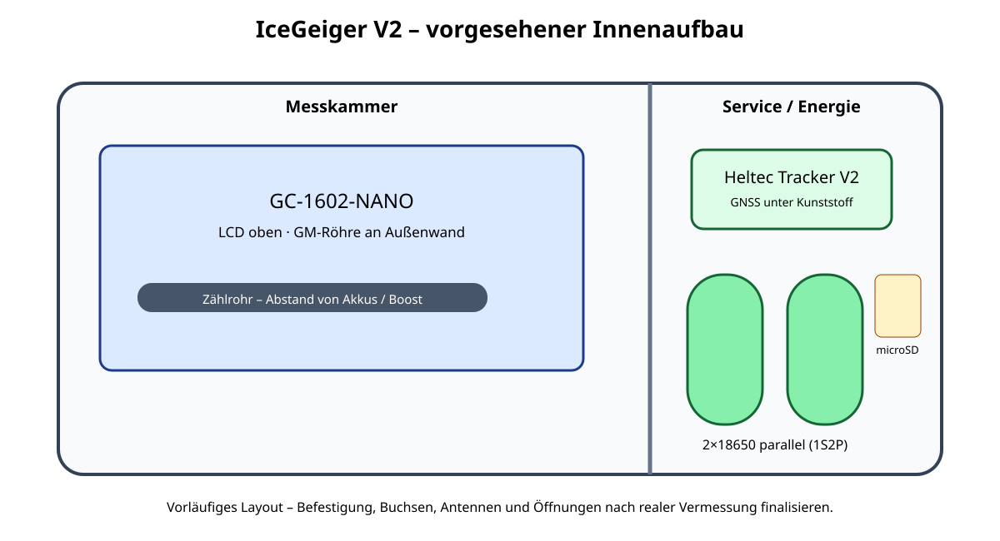
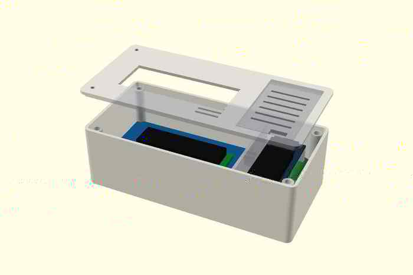

# V2 – Gehäuse / OpenSCAD / STL

- OpenSCAD: `hardware/v2/openscad/icegeiger_v2_enclosure.scad`
- STL: `hardware/v2/stl/`
- Messliste: `hardware/v2/MEASURE_AFTER_DELIVERY.md`





## Aufbau
Das Gehäuse ist in **Messkammer** (GC-1602-NANO mit Zählrohr/HV) und **Service-/Energiekammer** (2×18650, Heltec, microSD, Pegelteiler, 5-V-Boost) geteilt. Die Trennung reduziert die Gefahr, beim Akku-/SD-Service versehentlich an die HV-Seite zu gelangen.

## Druckteile
- `icegeiger_v2_base_PRELIMINARY.stl`
- `icegeiger_v2_lid_PRELIMINARY.stl`
- `icegeiger_v2_service_cover_PRELIMINARY.stl`
- `icegeiger_v2_fit_jig_PRELIMINARY.stl`

## Warum PRELIMINARY
Die Produktangabe von ca. 108 × 65 × 47 mm reicht nicht für ein maßhaltiges Gehäuse. Exakte PCB-/Lochmaße, LCD-Position, Nano-Überstand, Buchsen und Unterseitenaufbau sind vor Lieferung nicht sicher bekannt.

**Die eingecheckten PRELIMINARY-STLs sind bewusst vereinfachte, geschlossene Fit-/Layout-Prototypen; sie sind keine Druckfreigabe.** Die detaillierte Geometrie wird aus dem vollständig eigenständigen parametrierbaren OpenSCAD-Modell erzeugt. Nach Lieferung `MEASURE_AFTER_DELIVERY.md` ausfüllen, SCAD-Parameter korrigieren und `./scripts/build-stl.sh` ausführen.

## Material und Druckstartwerte
Für mobilen/Schuppenbetrieb PETG oder ASA bevorzugen. Startwerte PETG: 0,20-mm-Layer, 4 Perimeter, 25–35 % Infill, 5 Top/Bottom-Layer. Vor dem Vollgehäuse zuerst Fit-Jig drucken.

## Rendern
```bash
./scripts/build-stl.sh
./scripts/render-previews.sh
```
OpenSCAD wird ohne externe Libraries verwendet.
