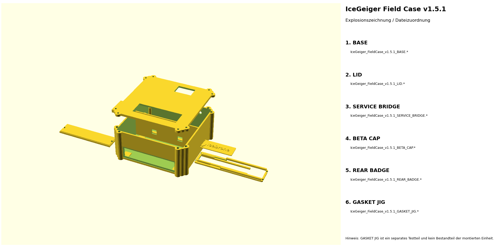

# V2 – Field Case / OpenSCAD / STL

Der aktuelle Druckstand liegt unter **`hardware/v2/field_case_v151/`**.

## Was sich in v1.5.1 geändert hat

Der erste reale Passformtest des dualen 18650 Battery Shields wurde in das CAD übernommen.

- Shield real gemessen: **100,2 × 48,0 mm**
- Lochmitten in Längsrichtung: **97,0 mm**
- Auflageschienen auf **90,0 mm** gekürzt
- daraus etwa **5,1 mm freie Länge pro PCB-Ende**
- vier separate **10 × 10 mm** Insert-Auflagen an den 97-mm-Lochachsen
- zwei **10 × 10 mm** Kabelöffnungen in der Zwischenwand
- **11-mm** Kabel-/Stromdurchführung an der Shield-Seite
- verstärkte Aufhängeöse mit **12-mm** Seilöffnung
- separates, andersfarbig druckbares `REAR_BADGE` mit Radioaktivsymbol und `IceDrone`

Die Y-Position der Shield-Gewindeeinsätze wird bewusst nicht aus dem Foto geraten: Das reale Shield wird auf die 10×10-mm-Auflagen gelegt und dient selbst als Bohr-/Heat-Insert-Schablone.

## Aufbau

Zwei Funktionszonen:

- **Messkammer:** GC-1602-NANO, LCD, Zählrohr und HV-Elektronik
- **Servicekammer:** duales 18650 Battery Shield, 2×18650, Service-Brücke, HITT-Tracker, microSD und LoRa-Pigtail

Die herausnehmbare Service-Brücke sitzt oberhalb der Akkus. Sie besitzt offene Schlitze für die bereits verlöteten Tracker-Pinleisten sowie eine offene Zone unter der GNSS-Patchantenne.

## Abmessungen

- CAD-Hauptkörper: **130 × 132 × 58 mm**
- Deckel: **4,2 mm**
- Service-Brücke: **119 × 31 mm**
- Beta-Schutzkappe: etwa **104 × 26 mm**
- Battery-Shield-Auflageschienen: **90 × 5 × 5 mm**
- Drone-Aufhängeöse: **12 mm freie Öffnung**

## OpenSCAD-Dateien

Das Gesamtmodell liegt in:

- `IceGeiger_FieldCase_v1.5.1_COMPLETE.scad`

Zusätzlich gibt es für jedes Teil eine eigene OpenSCAD-Wrapperdatei:

- `IceGeiger_FieldCase_v1.5.1_BASE.scad`
- `IceGeiger_FieldCase_v1.5.1_LID.scad`
- `IceGeiger_FieldCase_v1.5.1_SERVICE_BRIDGE.scad`
- `IceGeiger_FieldCase_v1.5.1_BETA_CAP.scad`
- `IceGeiger_FieldCase_v1.5.1_REAR_BADGE.scad`
- `IceGeiger_FieldCase_v1.5.1_GASKET_JIG.scad`

Die Wrapper laden die COMPLETE-Datei aus demselben Ordner, damit nur ein Master-CAD gepflegt werden muss.

## Druckteile

GitHub Actions erzeugt daraus unter `hardware/v2/field_case_v151/stl/`:

- `IceGeiger_FieldCase_v1.5.1_BASE.stl`
- `IceGeiger_FieldCase_v1.5.1_LID.stl`
- `IceGeiger_FieldCase_v1.5.1_SERVICE_BRIDGE.stl`
- `IceGeiger_FieldCase_v1.5.1_BETA_CAP.stl`
- `IceGeiger_FieldCase_v1.5.1_REAR_BADGE.stl`
- `IceGeiger_FieldCase_v1.5.1_GASKET_JIG.stl`

Zusätzlich werden PNGs aller Einzelteile sowie Komplett-, Layout- und beschriftete Explosionsansichten generiert.

## Battery-Shield-Befestigung

Die 90-mm-Schienen unterstützen die Längsseiten, ohne an den realen Endbereichen des Shields anzustoßen. Die vier 10×10-mm-Insert-Auflagen liegen an den gemessenen 97-mm-X-Achsen.

Vorgehen:

1. Base drucken.
2. Shield ohne Zellen trocken auflegen.
3. Shield so ausrichten, dass Anschlüsse und 11-mm-Durchführung frei bleiben.
4. durch die realen Shield-Bohrungen die 10×10-mm-Auflagen markieren.
5. Bohrung/Heat-Insert passend zur verwendeten M3-Hülse setzen.
6. erst danach Elektronik endgültig montieren.

## Kabeldurchführungen

Die Trennwand besitzt zwei Öffnungen mit **10 × 10 mm**. Sie sind für Stromversorgung sowie Signal-/Versorgungsleitungen zwischen GC-Kammer und Servicekammer vorgesehen.

Die äußere **11-mm-Durchführung** befindet sich beim Battery Shield und kann mit einer geeigneten Kabelverschraubung oder Durchführung belegt werden.

## Drone-Aufhängung

Die hintere/obere Gehäusewand trägt eine verstärkte Öse mit 12-mm-Loch. Sie ist für ein dickes Seil bzw. eine Drone-Sling-Aufhängung gedacht.

Ein FDM-gedruckter Lastpunkt ist **kein zertifiziertes Flugbauteil**. Vor einem Flug mit Mehrfachlast statisch prüfen und bei frühen Versuchen zusätzlich ein unabhängiges Sicherungsseil verwenden. Nicht über Personen testen.

## Beta-Fenster

Die Rohrseite besitzt ein etwa **96 × 18 mm** großes Fenster. Eine dünne 25–50-µm-PET/Mylar-Membran wird dauerhaft abgedichtet. Darüber sitzt eine starre abnehmbare Schutzkappe.

## Spritzwasserschutz

- 2-mm-Silikonrundschnur
- Nut 2,45 × 1,55 mm
- acht M3-Anpresspunkte
- Polycarbonatfenster von innen
- abgedichtete SMA-Bulkhead-Durchführung
- M12-Schalteröffnung
- Beta-Fenster mit Membran + Schutzkappe

Das ist eine Konstruktionsmaßnahme für Spritzwasserschutz, **keine IP-Zertifizierung**.

## Kollisionsprüfung

`hardware/v2/field_case_v151/check_fit.py` prüft die bekannten Hüllen und die neue Shield-Geometrie.

Wichtige berechnete Abstände:

- Auflageschiene: **90,0 mm**
- Shield-Endfreiheit: **ca. 5,1 mm je Ende**
- Shield-Unterseitenbauteil → Gehäuseboden: **ca. 1,2 mm**
- Akkuoberseite → Service-Brücke: **ca. 4,1 mm**
- Akkuoberseite → Tracker-Pinspitzen: **ca. 5,0 mm**
- Tracker → Deckelebene: **ca. 9,4 mm**
- microSD → Deckelebene: **ca. 9,1 mm**
- GC-Verkäuferhülle → Deckelebene: **ca. 6,5 mm**

## GC-1602

Für den GC wird weiterhin die Händlerhülle **108 × 65 × 47 mm** verwendet. Weil das reale GC-Lochbild noch nicht exakt vermessen ist, verwendet v1.5.1 weiterhin breite massive Eckpads statt erfundener Lochabstände.

v1.5.1 ist der aktuelle **Print Candidate** für den laufenden physischen Passformtest.
