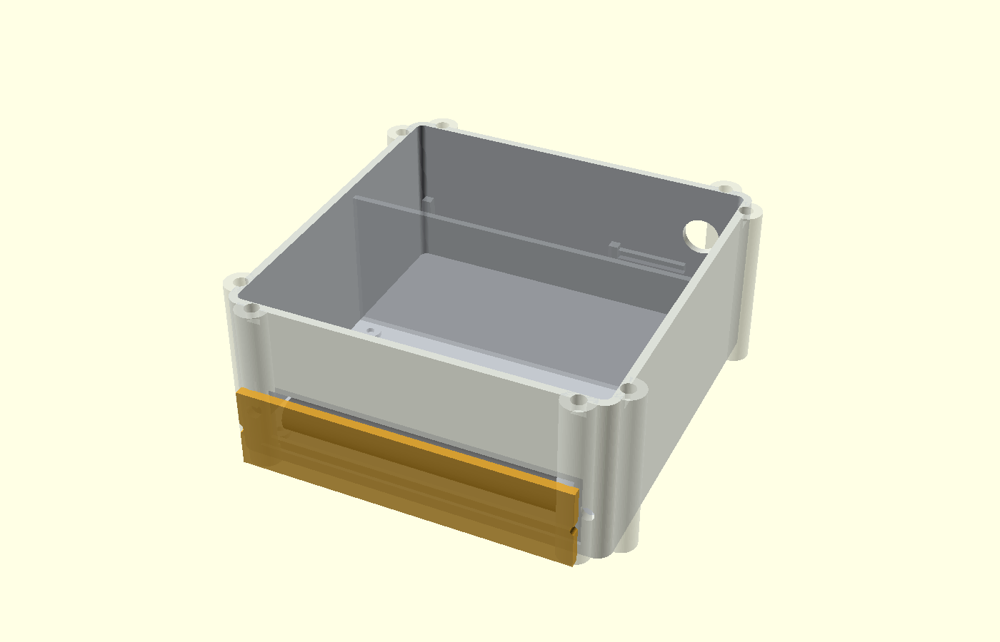

# V2 – Field Case / OpenSCAD / STL

Der aktuelle mechanische Stand liegt unter `hardware/v2/field_case_v12/`.

## Aufbau

Zwei Kammern teilen das Gehäuse:

- **Messkammer:** GC-1602-NANO, LCD, Zählrohr und HV-Elektronik
- **Servicekammer:** 2×18650, HITT-Tracker, microSD, BMS, 5-V-Regler, LoRa-Pigtail

Der Tracker liegt auf einem herausnehmbaren offenen Rahmen oberhalb eines Teils der Servicekammer. Seine bereits verlöteten Stiftleisten hängen in die freie Mitte des Rahmens. Die GNSS-Patchantenne liegt über einem metallfreien Hohlraum, nicht über den Akkuzellen.

## Abmessungen

- Hauptkörper: 120 × 120 × 54 mm
- Deckel: 4,2 mm
- maximale STL-Hüllfläche inklusive Schraubbossen: ca. 130,4 × 130,4 mm
- Tracker-Shelf: 70,64 × 32,8 × 4,4 mm
- Beta-Schutzkappe: 106 × 4 × 26 mm

## Druckteile

- `icegeiger_field_case_v12_base_PRELIMINARY.stl`
- `icegeiger_field_case_v12_lid_PRELIMINARY.stl`
- `icegeiger_field_case_v12_tracker_shelf_PRELIMINARY.stl`
- `icegeiger_field_case_v12_beta_cap_PRELIMINARY.stl`
- `icegeiger_field_case_v12_gasket_jig_TEST.stl`
- `icegeiger_field_case_v12_fit_jig_TEST.stl`

Die lokal erzeugten Meshes wurden auf watertight-Geometrie geprüft und bestehen jeweils aus einer zusammenhängenden Mesh-Komponente.

## Beta-Fenster

Die Rohrseite besitzt ein 98 × 18 mm großes Fenster. Eine dünne 25–50-µm-PET/Mylar-Membran wird dauerhaft abgedichtet. Darüber sitzt eine starre abnehmbare Schutzkappe. Damit bleibt das Rohr für Beta-Messungen wesentlich weniger abgeschirmt, ohne dass das Gehäuse im Transport offen bleibt.

## Spritzwasserschutz

- 2-mm-Silikonrundschnur
- Nut 2,45 × 1,55 mm
- acht M3-Anpresspunkte
- Polycarbonatfenster von innen
- abgedichtete SMA-Bulkhead-Durchführung
- M12-Dichtschalter

Das ist eine Konstruktionsmaßnahme für Spritzwasserschutz, **keine IP-Zertifizierung**.

## Kollisionsprüfung

Siehe `hardware/v2/field_case_v12/FIT_REPORT.md`. Aktuell keine konservativen Hüllkollisionen; kleinster designierter Abstand ist 1,40 mm Akkuhalter → Innenwand. Tracker-Pinspitzen haben 2,00 mm Luft über dem Akkuhalter.

## PRELIMINARY

Der Tracker ist real vorhanden und in den Maßen abgesichert. GC-1602-Bohrbilder, genaue Rohrposition und LCD-Höhe werden nach Lieferung nachgetragen. Bis dahin bleiben Base/Lid/Beta-Cap als PRELIMINARY gekennzeichnet.
