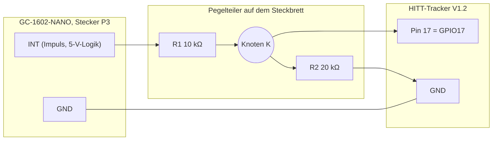

# V2 – Phase D: INT-Schnittstelle Schritt für Schritt

Ziel: Den Impulsausgang (`INT`) des GC-1602-NANO sicher an **GPIO17** des HITT-Trackers anschließen und die Zählung gegen die Klicks des Piezos prüfen. Dies ist die ausführliche Fassung von Phase D aus [08-assembly.md](08-assembly.md).

> **Sicherheit:** Das GC-1602 erzeugt für die Röhre mehrere hundert Volt. Nach dem Ausschalten wird **gewartet und entladen**, bevor gearbeitet wird. Erden ist nicht die Schutzmaßnahme. Die vollständigen Regeln stehen in [07-safety-and-radiation-basics.md](../07-safety-and-radiation-basics.md), Abschnitt A1.
> Der ESP32-S3 verträgt an GPIO-Pins **maximal 3,6 V**. `INT` darf nie direkt an den Tracker.

## Verdrahtung

| Von | Über | Nach |
|---|---|---|
| GC `INT` (P3) | R1 10 kΩ | Knoten K |
| Knoten K | R2 20 kΩ | GND |
| Knoten K | Draht | Tracker-Pin **17** |
| GC `GND` (P3) | Draht | Tracker `GND` |

Der `5V`-Pin von P3 wird **nicht** mit dem Tracker verbunden.

Erwartete Spannungen: `INT` im Ruhezustand ca. 4,4 V (gemessen 4,39 V bei USB-Versorgung über den Nano, siehe [13-validation-status.md](13-validation-status.md)). Am Knoten K ergeben sich damit ca. 2,9 V. Der ESP32-S3 erkennt High ab etwa 2,5 V.

## Material

- 1 × 10 kΩ, 1 × 20 kΩ (oder zwei 10 kΩ in Reihe)
- Multimeter (DC)
- Dupont-Kabel, Steckbrett
- isolierende Unterlage aus Holz oder Kunststoff, keine Metallfläche

## Schritt 1 – Beide Geräte ausschalten und warten

1. Nano-USB des GC-1602 ziehen. Das ist seine einzige Stromquelle.
2. Tracker-USB ebenfalls ziehen.
3. **Mindestens 5 Minuten warten, bei Unsicherheit 10.** Das ist ein bewusst vorsichtiger Wert. Die Regel in Dokument 07 verlangt mindestens 1 Minute, die reale Entladezeit dieses Boards ist nicht gemessen.
4. Board flach auf die Unterlage legen. Röhre, Lötseite und Röhrenanschlüsse nicht berühren, nur die Stiftleiste P3.

## Schritt 2 – Teiler aufbauen (Knoten K bleibt frei)

1. Am Stecker P3 die Beschriftung lesen: `INT`, `GND`, `5V`. Ist sie nicht eindeutig, hier stoppen und dokumentieren (Foto).
2. Am Tracker den Pin mit der Beschriftung **17** suchen. Ist er nicht herausgeführt, hier stoppen.
3. Kette aufbauen: `INT` → R1 → K → R2 → GND. K geht noch nirgends hin.
4. `GC GND` mit `Tracker GND` verbinden.

## Schritt 3 – Pegel messen (nur GC an, Tracker bleibt aus)

1. Nano-USB stecken und 15 Sekunden warten.
2. Mit einer Hand messen (DC):

| Messung | Erwartung | Gemessen |
|---|---|---|
| `INT` gegen GND | ca. 4,4 V | |
| Knoten K gegen GND | ca. 2,9 V | |

3. **Stopp**, wenn K über 3,3 V liegt oder `INT` deutlich von etwa 4,4 V abweicht. K bleibt dann unverbunden.
4. Bei Werten im Rahmen: GC-USB wieder ziehen und **erneut 5 Minuten warten**.

## Schritt 4 – Anschließen

1. Knoten K mit Tracker-Pin 17 verbinden.
2. Beide USB-Kabel stecken, zuerst den Tracker.
3. Ab jetzt bei eingeschaltetem GC nichts mehr umstecken.

## Schritt 5 – Zähltest (10 Minuten)

Bei ca. 5 bis 10 CPM werden in 10 Minuten etwa 50 bis 100 Impulse erwartet.

1. Die Tracker-Zählung über das MQTT-Topic `icegeiger/icegeiger-v2/live` mitlesen (Feld `counts_10s`, ein Wert alle 10 Sekunden).
2. Parallel **drei Mal je 2 Minuten** die Klicks des Piezos zählen und mit der Tracker-Zählung im selben Zeitraum vergleichen. Das LCD des GC-1602 rundet zu grob für diesen Vergleich.

| Lauf | Zeitraum | Klicks (Piezo) | Impulse (Tracker) |
|---|---|---|---|
| 1 | | | |
| 2 | | | |
| 3 | | | |

Bewertung:

- Klicks und Impulse liegen in derselben Größenordnung: bestanden.
- Etwa doppelt so viele Impulse wie Klicks: mögliche Doppelzählung (Prellen an der Flanke oder Pulsform prüfen).
- Impulse ohne Klicks: mögliches Rauschen auf der Leitung. Leitung verkürzen, Masseverbindung prüfen.

## Ergebnis

Nach dem Test werden die Messwerte in [13-validation-status.md](13-validation-status.md) eingetragen und Test 2 (Pulszählung) in [09-commissioning-test.md](09-commissioning-test.md) abgehakt.
